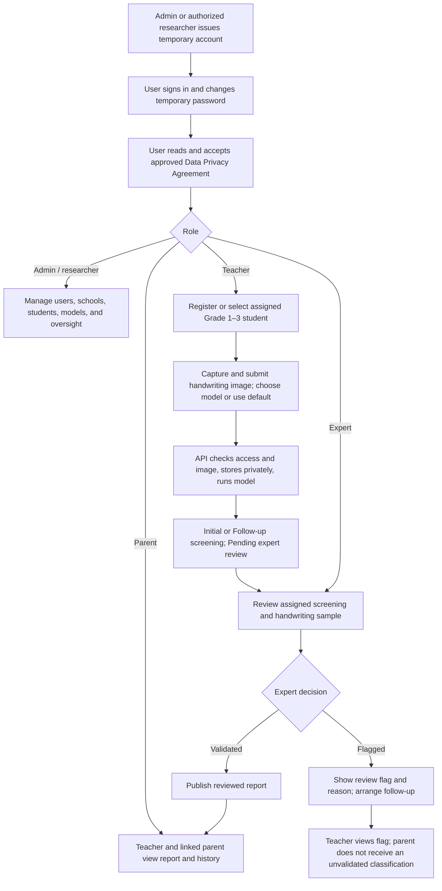

# GraphiScan target system design

This records the intended workflow and stack decisions from 2026-09-29. They are not claims that the current app already implements them. See [KNOWLEDGE.md](KNOWLEDGE.md) for current behavior and [PROJECT_PLAN.md](PROJECT_PLAN.md) for work and panel status.

## Target workflow

Decision date: 2026-09-29. This is the target behavior for the admin web app, native mobile app, and Flask API. It follows the numbered comments in `C:\Users\MY_PC\Downloads\GRAPHISCAN_DEFENSE_MINUTES.md` and the agreed Grades 1–3 scope in `GRAPHISCAN_CONTEXT.md`. It is **not** a statement that every step already works in the current code. See `PROJECT_PLAN.md` for implementation status.

### Core rule

GraphiScan is a handwriting **screening aid**, not a diagnosis. The model provides a classification and model score; a qualified expert reviews it. The Flask API decides who can read or change each record. Admin web and mobile use the same API rules.

### 1. Accounts and first access (panel item 10)

1. Only a GraphiScan administrator or **authorized researcher** creates an account, assigns its role, and gives that person a temporary password through an approved private channel. There is no public sign-up. A researcher needs an explicit account-management permission; the role name alone does not grant it.
2. At first sign-in, the user can access only the password-change flow. The API rejects all other protected actions while `must_change_password` is true. After a successful change, the temporary password is no longer valid.
3. The user then reads and accepts the **approved, versioned** Data Privacy Agreement. Store the version and acceptance time. Until accepted, the API allows only the agreement and sign-out flows. If the approved agreement version changes, require acceptance of the new version before normal access.
4. Only after both gates pass does the user enter the role-specific workspace. A disabled account cannot access it. Password reset must not silently bypass either gate.

The actual agreement wording must be supplied and approved by the project/school. No placeholder text should be presented as an approved agreement.

### 2. Roles and record access

| Role | Main work | Access boundary |
| --- | --- | --- |
| Administrator | Issue/disable accounts; manage schools, students, model availability; review reports and audit activity | Protected admin web app. Account-management actions require explicit permission. |
| Authorized researcher | Create accounts and review approved study records as assigned | Only permissions explicitly granted by the administrator; no implicit unrestricted access. |
| Teacher | Register/manage assigned students, capture images, choose a validated model, view provisional and reviewed results, monitor history | Only assigned students and their records. |
| Expert | Review the image, result, and history; validate or flag; enter professional remarks and any justified recommendation | Only screenings assigned or otherwise authorized for that expert. |
| Parent/guardian | View linked child's **expert-reviewed** reports and progress | Only linked child records. Pending or flagged model labels are withheld from the parent view. |
| Guest/demo user | View educational information and, if enabled, run a clearly marked sample-only demo | Admin-issued account if login is used. No access to real student records; demo is never saved as an official screening. |

Public information can be shown without an account. It must not expose student records or allow public registration.

### 3. Student setup (panel item 9)

1. Admin/researcher maintains the school list. An authorized teacher or admin creates a student under one school and **Grade 1, 2, or 3**, then assigns a teacher and optionally links the parent account.
2. The API checks grade, school, assignment, and duplicates before accepting the record. The admin can filter and summarize students by school and grade.
3. Student names, images, and reports remain private. The client never receives a public storage URL for a handwriting image.

### 4. Screening and model choice (panel items 1, 2, 5)

1. The teacher selects an assigned student and captures or chooses a clear handwriting image. The app shows the current **default model** and offers the other validated ResNet, EfficientNet, and MobileNet models for manual selection. The default is selected from a common three-class evaluation using the agreed accuracy method; old binary accuracy is not compared with new three-class accuracy.
2. The API validates the user/student relationship and the image. Failed or unsupported uploads receive a clear retry message and do not become official screenings.
3. The API stores the image in private storage, applies that model's documented preprocessing, runs inference, and saves the model key/version, task type, three class scores, predicted label, and confidence. Display `Normal`, `Low Potential`, or `High Potential` prominently. A score is a **model output**, not a clinical probability or diagnosis.
4. The student's **first completed official assessment is the one and only `Initial Screening`**. Every later assessment is a **follow-up for progress monitoring**, stored as `Follow-up Screening` to match the defense minutes. No later assessment is called a new Initial Screening. The API chooses the type transactionally for one student so simultaneous uploads cannot create two Initial records. The user does not choose the type. Demo or failed attempts do not count.
5. The result/report begins as **Pending expert review**. The teacher can see the provisional model output with that status; the parent cannot see an unvalidated classification.
6. The AI gives **no recommendations or interventions**. Any professional recommendation is written by and attributed to the expert after review.

Historical binary results may remain in history with their original model and two-class labels. They must not be relabeled `Low Potential` or plotted as though their scores were equivalent to a three-class model.

### 5. Expert review and report release (panel item 3)

1. The assigned expert opens the pending item, sees the handwriting image, student context, model/version, model score, and prior screening history.
2. The expert chooses `Validated` or `Flagged` and supplies a reasoned remark. An expert-authored recommendation is optional; if present it must be grounded in the review and marked with the expert's identity and review date.
3. `Validated` makes the reviewed report available to the teacher and linked parent. `Flagged` keeps the model label provisional, shows the reason to authorized staff, and can request a new sample or follow-up. The parent may see that review is pending, but not the unvalidated label.
4. The audit trail records the actor, decision, and time. Only an authorized expert can make or change a validation.

### 6. Reports and progress (panel item 11)

- A report shows school and grade, screening type, date, handwriting sample access for authorized users, model/version, classification, model score, and expert validation state. Expert remarks and recommendations are labeled as human-authored. The wording states that screening is not diagnosis.
- Progress begins with the student's single **Initial Screening** and continues with later **Follow-up assessments**. The stored follow-up report type is `Follow-up Screening`, as worded in the panel minutes. Compare results only when the model task and score meaning are comparable; otherwise show the model/version and narrative history without claiming measured improvement.
- Admin/researcher may view school-and-grade summaries within their authorization. Teachers see assigned students. Parents see only their linked child's released reports.

### Current implementation gaps before deployment

- The live mobile app is still Vue/Capacitor and the API still uses MySQL and local static uploads. Supabase Auth, PostgreSQL, private Storage, and Expo are target components, not live ones.
- First-login password change, approved agreement gate, school grouping, expert assignment, and parent release rules are not yet implemented end to end.
- Live inference is binary and loads one model. Three-class comparison, multi-model selection, and model/version recording remain open.
- AI advice was removed from current predictor/API/display source, but older stored advice and the obsolete database column require migration cleanup.
- Initial/Follow-up labeling has changed in the two current upload paths but has not been checked against a running database or made concurrency-safe.
- The old Flask-rendered routes remain reachable and must follow the same rules or be retired before deployment.

## Stack and hosting decision

Decision date: 2026-09-29. This is the agreed target architecture for the capstone pilot. It is not a claim that migration, model validation, or deployment is complete. Deployment is a later phase.

### Architecture

`Vue admin (Vercel)` and `React Native mobile (installed on devices)` → `Flask JSON API (Cloud Run)` → `Supabase PostgreSQL + private Storage`.

`Supabase Auth` issues login sessions to both clients. Flask verifies the user token and enforces role, student ownership, first-login password change, and approved privacy agreement acceptance before returning protected data. Flask runs `TensorFlow/Keras` inference and stores the model/version with each result. Clients never hold a server secret key or connect directly to private student tables.

### Stack

| Part | Decision | Current state |
| --- | --- | --- |
| Admin website | Vue 3 + Vite, keep the existing app | Existing admin screens and JavaScript remain useful; no value in rewriting them. |
| Android mobile app | React Native + Expo + TypeScript, built as a native Android app | Current mobile app is Vue 3 + Capacitor; retain it until the new app reaches feature parity. The new app must use release builds for performance decisions, not Expo Go. |
| Backend API | Python + Flask, JSON REST API | Existing role and inference logic is in Flask. Run with a production WSGI server such as Gunicorn on Linux; do not use Flask's debug server in deployment. Do not switch to FastAPI solely for speed. |
| Inference | TensorFlow/Keras behind the Flask API | Production remains binary today. Target is Normal / Low Potential / High Potential using all three validated model families, with the best evaluated model as default and manual model selection. Record model name and version with every screening. |
| Database | Supabase PostgreSQL | Current SQL and connection code use MySQL. Migrate schema and queries deliberately. XAMPP/MySQL are only part of the current local setup, not the target stack. |
| Authentication | Supabase Auth plus Flask authorization | The GraphiScan team (administrator or authorized researcher) creates each account and provides a temporary password. On first login, that user must choose a new password and accept the approved Data Privacy Agreement before accessing features. Supabase Auth manages credentials and sessions; Flask enforces these gates, roles, and student ownership from trusted database records. Current in-memory Flask tokens must be replaced. |
| Image storage | Supabase Storage, private bucket | Current images are saved under Flask static files. Use server-authorized uploads/downloads or short-lived signed URLs; never expose student images through a public bucket. |
| Source control | Private GitHub repository | Store source and safe templates, never credentials, real student data, private models, or raw datasets. |

The target account fields and consent history start in `graphiscan/db/postgres/001_identity.sql`. Applying that migration and connecting it to Supabase Auth and Flask are still pending. A user account must be created through an authorized admin/researcher server action, with `must_change_password = true`. The login flow must allow only password change and agreement acceptance until onboarding is complete. Existing numeric MySQL user IDs will require a reviewed mapping to Supabase Auth UUIDs.

The old MySQL database has eight tables. A schema-only reference was extracted to `graphiscan/db/legacy_mysql_schema.sql` from a local export dated 2026-07-28. It contains no row data, but it may be older than the current XAMPP database. The original export contains private rows and must remain outside Git. `C:\Users\MY_PC\Downloads\CAPSTONE\graphiscan_db` is a separate folder of MySQL/MariaDB `.frm` and `.ibd` table files, not a portable SQL migration. The XAMPP copy of the eight tables has later file timestamps, so use a fresh logical export from the authoritative running database before migrating any rows. Target PostgreSQL table drafts are now in `001_identity.sql` and `002_screening.sql`; neither has been applied, and the import/API conversion remains open. See `graphiscan/db/MIGRATION_NOTES.md` for the table mapping. XAMPP can be retired only after a current backup, PostgreSQL schema/data migration, API conversion, and cutover are complete.

### What must be hosted

| Item | Proposed free-tier service | What gets deployed or stored |
| --- | --- | --- |
| Admin website | Vercel Hobby for the capstone pilot | Built Vue static files. Set project Root Directory to `graphiscan/admin-web`, Build Command to `npm run build`, Output Directory to `dist`, and `VITE_API_ORIGIN` to the production HTTPS API origin. |
| API and model | Google Cloud Run | Container containing Flask, dependencies, and a provisioned model artifact. Set an appropriate memory limit and one model-loading strategy. |
| Database and login | Supabase Free PostgreSQL and Auth | Accounts, students, screenings, validation, consent records, and reports; Auth issues sessions. |
| Private images | Supabase Free Storage | Original handwriting images and access policies. Do not put student samples in public buckets or Git. |
| Mobile app | Expo EAS Free for Android builds; distribute the resulting APK/AAB as appropriate | The app itself is installed on devices and calls the HTTPS API. EAS builds are a build service, not app runtime hosting. Google Play distribution is separate. |
| Source code | Existing private GitHub repository | Source and safe templates only. Never upload real `.env`, credentials, student records/images, raw datasets, or private model artifacts. |

Free subdomains from the hosting services suffice for a pilot; a custom domain is optional. Choose a region near the users where each provider offers one. Keep API credentials only on the server; the mobile and web builds may contain only public endpoint URLs and carefully scoped public keys.

### Free-tier limits and practical decision

These figures and terms were recorded on 2026-09-29; recheck provider terms before deployment.

- Vercel Hobby can host the Vue/Vite admin app for a personal, non-commercial capstone pilot. Its Hobby plan is restricted to non-commercial personal use. Source: https://vercel.com/docs/plans/hobby
- Cloudflare Pages Free remains an alternative static host if Vercel's Hobby terms do not fit the deployment. It allows 500 builds per month. Source: https://developers.cloudflare.com/pages/platform/limits/
- Supabase Free lists 500 MB database size, 1 GB storage, and 5 GB egress. Inactive free projects can be paused. Sources: https://supabase.com/docs/guides/platform/billing-on-supabase and https://supabase.com/docs/guides/platform/free-project-pausing
- Cloud Run has a monthly free allowance, but requires a Google Cloud billing account and charges beyond allowance. A cold start and TensorFlow model load could exceed the manuscript's 5-second response target. Measure this before a live demonstration. Sources: https://cloud.google.com/run/pricing and https://docs.cloud.google.com/docs/get-started/learn-about-billing
- If a billing account is unavailable, Render Free is a temporary API demo option. It sleeps after 15 minutes without traffic, may take about a minute to wake, and loses local files on restart, so it cannot meet a reliable 5-second target. Source: https://render.com/docs/free
- Expo EAS Free has limited monthly Android builds. Source: https://expo.dev/pricing

These free tiers are a capstone pilot plan, not a guarantee of zero cost, uptime, or suitability for real student records. Before collecting real student data, review consent, access, retention, backups, and the hosting providers' terms with the school. A production service may need a paid tier.

#### Small-pilot budget check (2026-10-01)

| Choice | Approximate monthly base | What changes |
| --- | --- | --- |
| Demo with synthetic records | $0 in fixed plan fees: Cloudflare Pages Free (or eligible Vercel Hobby), Supabase Free, Expo EAS Free | Cloud Run still requires a billing account and may incur usage charges; with zero minimum instances, cold starts can slow model inference. Supabase Free may pause after inactivity and does not include accessible automatic daily backups. |
| Modest paid pilot | $25 for one Supabase Pro project, plus actual Cloud Run usage; keep static admin hosting and EAS builds free | Supabase Pro adds daily backups retained seven days and avoids Free-project pausing. Extra Pro projects and overages cost more. |
| Optional convenience upgrades | Add Vercel Pro at $20/month and/or Expo EAS Starter at $19/month | These are optional for the pilot; more team seats, usage, taxes, and other add-ons can increase the bill. |

For a limited school pilot, prioritize verified server authorization, private image access, an approved privacy agreement, and a recoverable backup before paying for faster builds or admin-site hosting. A paid plan alone does not make student records safe. Cloud Run pricing depends on region, memory, traffic, and whether a minimum instance is kept warm; estimate it with the actual model container and set billing alerts before cutover. Sources checked 2026-10-01: https://supabase.com/pricing , https://supabase.com/features/database-backups , https://supabase.com/docs/guides/platform/free-project-pausing , https://cloud.google.com/run/pricing , https://docs.cloud.google.com/docs/get-started/learn-about-billing , https://vercel.com/docs/plans/pro-plan , https://expo.dev/pricing .

### Why React Native with Expo instead of Flutter

- Both can produce smooth native Android and iOS apps. React Native renders platform views; Flutter draws its own widgets with its rendering engine. Neither guarantees smoothness on an underpowered phone or a slow API.
- React Native lets the team keep using JavaScript concepts from Vue, while learning React and TypeScript. Flutter would require learning Dart and a second UI ecosystem during the same database, auth, and model migration. This is a project-delivery decision, not a claim that Flutter is inferior.
- Expo simplifies camera/image picker, permissions, Android builds, and device iteration. An Expo app is a React Native native app, not a WebView. For real development use a development build; Expo Go is only a limited playground. Release builds must be assessed on target devices.
- Flutter is a strong alternative if the team already knows Dart or needs highly custom, consistent graphics. For GraphiScan's forms, image capture, reports, and charts, React Native's native views are sufficient if implemented carefully.

Sources: https://reactnative.dev/docs/performance, https://docs.expo.dev/workflow/overview/, https://docs.flutter.dev/resources/architectural-overview, https://docs.flutter.dev/perf/ui-performance

### What this decision does not promise

- A fast mobile UI does not make TensorFlow inference or a sleeping free-tier backend fast. The manuscript's five-second result target needs release-build and hosted-API measurements.
- Supabase Free can pause for low activity and Cloud Run can cold start. Cloud Run needs billing enabled; staying inside its allowance is a usage goal, not a guaranteed zero bill.
- The three-class model is a target. Do not call the existing binary model three-class or present its 86.03% result as a three-class result.

### Deployment sequence

1. Finish the data model and migrate MySQL queries/data to PostgreSQL with a reviewed migration and backup plan.
2. Replace local static uploads with a private storage flow; enforce server-side authorization for every image and record.
3. Implement team-issued temporary accounts, a server-enforced first-login password change, approved privacy agreement acceptance, and durable authentication. Never store or send temporary passwords in Git or application logs.
4. Finalize and validate the three-class model registry and screening semantics; package model artifacts outside Git.
5. Deploy the API and database, then the admin site, then the Expo app using environment-specific HTTPS API URLs.
6. Measure real-device upload, model startup, response time, and free-tier usage before calling the deployment ready.
