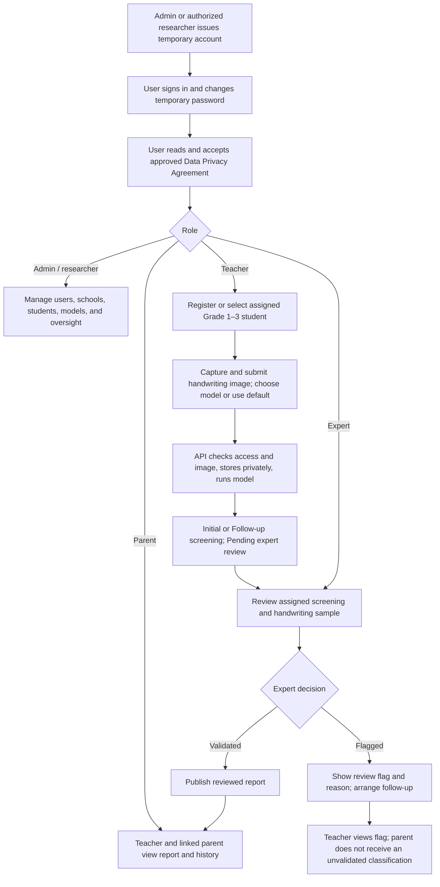

# GraphiScan final system flow

Decision date: 2026-09-29. This is the target behavior for the admin web app, native mobile app, and Flask API. It follows the numbered comments in `C:\Users\MY_PC\Downloads\GRAPHISCAN_DEFENSE_MINUTES.md` and the agreed Grades 1–3 scope in `GRAPHISCAN_CONTEXT.md`. It is **not** a statement that every step already works in the current code. See `PANEL_COMPLIANCE.md` for implementation status.

## Core rule

GraphiScan is a handwriting **screening aid**, not a diagnosis. The model provides a classification and model score; a qualified expert reviews it. The Flask API decides who can read or change each record. Admin web and mobile use the same API rules.

## 1. Accounts and first access (panel item 10)

1. Only a GraphiScan administrator or **authorized researcher** creates an account, assigns its role, and gives that person a temporary password through an approved private channel. There is no public sign-up. A researcher needs an explicit account-management permission; the role name alone does not grant it.
2. At first sign-in, the user can access only the password-change flow. The API rejects all other protected actions while `must_change_password` is true. After a successful change, the temporary password is no longer valid.
3. The user then reads and accepts the **approved, versioned** Data Privacy Agreement. Store the version and acceptance time. Until accepted, the API allows only the agreement and sign-out flows. If the approved agreement version changes, require acceptance of the new version before normal access.
4. Only after both gates pass does the user enter the role-specific workspace. A disabled account cannot access it. Password reset must not silently bypass either gate.

The actual agreement wording must be supplied and approved by the project/school. No placeholder text should be presented as an approved agreement.

## 2. Roles and record access

| Role | Main work | Access boundary |
| --- | --- | --- |
| Administrator | Issue/disable accounts; manage schools, students, model availability; review reports and audit activity | Protected admin web app. Account-management actions require explicit permission. |
| Authorized researcher | Create accounts and review approved study records as assigned | Only permissions explicitly granted by the administrator; no implicit unrestricted access. |
| Teacher | Register/manage assigned students, capture images, choose a validated model, view provisional and reviewed results, monitor history | Only assigned students and their records. |
| Expert | Review the image, result, and history; validate or flag; enter professional remarks and any justified recommendation | Only screenings assigned or otherwise authorized for that expert. |
| Parent/guardian | View linked child's **expert-reviewed** reports and progress | Only linked child records. Pending or flagged model labels are withheld from the parent view. |
| Guest/demo user | View educational information and, if enabled, run a clearly marked sample-only demo | Admin-issued account if login is used. No access to real student records; demo is never saved as an official screening. |

Public information can be shown without an account. It must not expose student records or allow public registration.

## 3. Student setup (panel item 9)

1. Admin/researcher maintains the school list. An authorized teacher or admin creates a student under one school and **Grade 1, 2, or 3**, then assigns a teacher and optionally links the parent account.
2. The API checks grade, school, assignment, and duplicates before accepting the record. The admin can filter and summarize students by school and grade.
3. Student names, images, and reports remain private. The client never receives a public storage URL for a handwriting image.

## 4. Screening and model choice (panel items 1, 2, 5)

1. The teacher selects an assigned student and captures or chooses a clear handwriting image. The app shows the current **default model** and offers the other validated ResNet, EfficientNet, and MobileNet models for manual selection. The default is selected from a common three-class evaluation using the agreed accuracy method; old binary accuracy is not compared with new three-class accuracy.
2. The API validates the user/student relationship and the image. Failed or unsupported uploads receive a clear retry message and do not become official screenings.
3. The API stores the image in private storage, applies that model's documented preprocessing, runs inference, and saves the model key/version, task type, three class scores, predicted label, and confidence. Display `Normal`, `Low Potential`, or `High Potential` prominently. A score is a **model output**, not a clinical probability or diagnosis.
4. The student's **first completed official assessment is the one and only `Initial Screening`**. Every later assessment is a **follow-up for progress monitoring**, stored as `Follow-up Screening` to match the defense minutes. No later assessment is called a new Initial Screening. The API chooses the type transactionally for one student so simultaneous uploads cannot create two Initial records. The user does not choose the type. Demo or failed attempts do not count.
5. The result/report begins as **Pending expert review**. The teacher can see the provisional model output with that status; the parent cannot see an unvalidated classification.
6. The AI gives **no recommendations or interventions**. Any professional recommendation is written by and attributed to the expert after review.

Historical binary results may remain in history with their original model and two-class labels. They must not be relabeled `Low Potential` or plotted as though their scores were equivalent to a three-class model.

## 5. Expert review and report release (panel item 3)

1. The assigned expert opens the pending item, sees the handwriting image, student context, model/version, model score, and prior screening history.
2. The expert chooses `Validated` or `Flagged` and supplies a reasoned remark. An expert-authored recommendation is optional; if present it must be grounded in the review and marked with the expert's identity and review date.
3. `Validated` makes the reviewed report available to the teacher and linked parent. `Flagged` keeps the model label provisional, shows the reason to authorized staff, and can request a new sample or follow-up. The parent may see that review is pending, but not the unvalidated label.
4. The audit trail records the actor, decision, and time. Only an authorized expert can make or change a validation.

## 6. Reports and progress (panel item 11)

- A report shows school and grade, screening type, date, handwriting sample access for authorized users, model/version, classification, model score, and expert validation state. Expert remarks and recommendations are labeled as human-authored. The wording states that screening is not diagnosis.
- Progress begins with the student's single **Initial Screening** and continues with later **Follow-up assessments**. The stored follow-up report type is `Follow-up Screening`, as worded in the panel minutes. Compare results only when the model task and score meaning are comparable; otherwise show the model/version and narrative history without claiming measured improvement.
- Admin/researcher may view school-and-grade summaries within their authorization. Teachers see assigned students. Parents see only their linked child's released reports.

## Current implementation gaps before deployment

- The live mobile app is still Vue/Capacitor and the API still uses MySQL and local static uploads. Supabase Auth, PostgreSQL, private Storage, and Expo are target components, not live ones.
- First-login password change, approved agreement gate, school grouping, expert assignment, and parent release rules are not yet implemented end to end.
- Live inference is binary and loads one model. Three-class comparison, multi-model selection, and model/version recording remain open.
- AI advice was removed from current predictor/API/display source, but older stored advice and the obsolete database column require migration cleanup.
- Initial/Follow-up labeling has changed in the two current upload paths but has not been checked against a running database or made concurrency-safe.
- The old Flask-rendered routes remain reachable and must follow the same rules or be retired before deployment.
